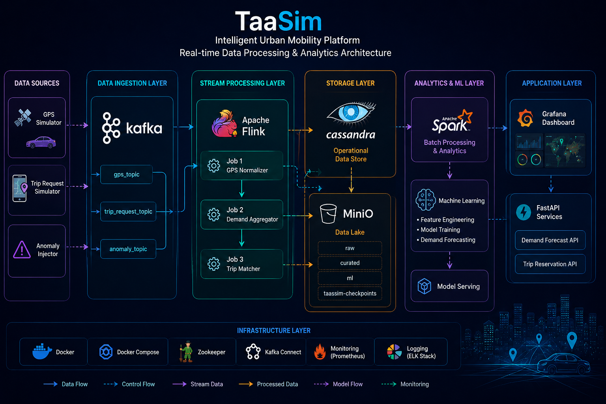
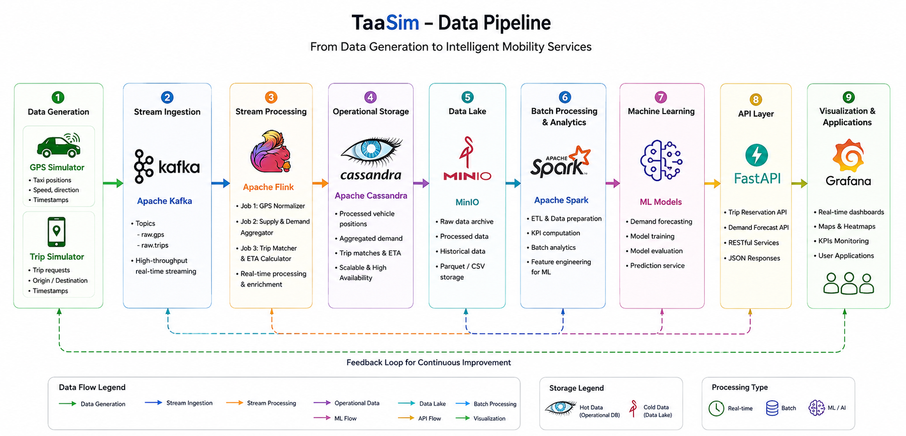
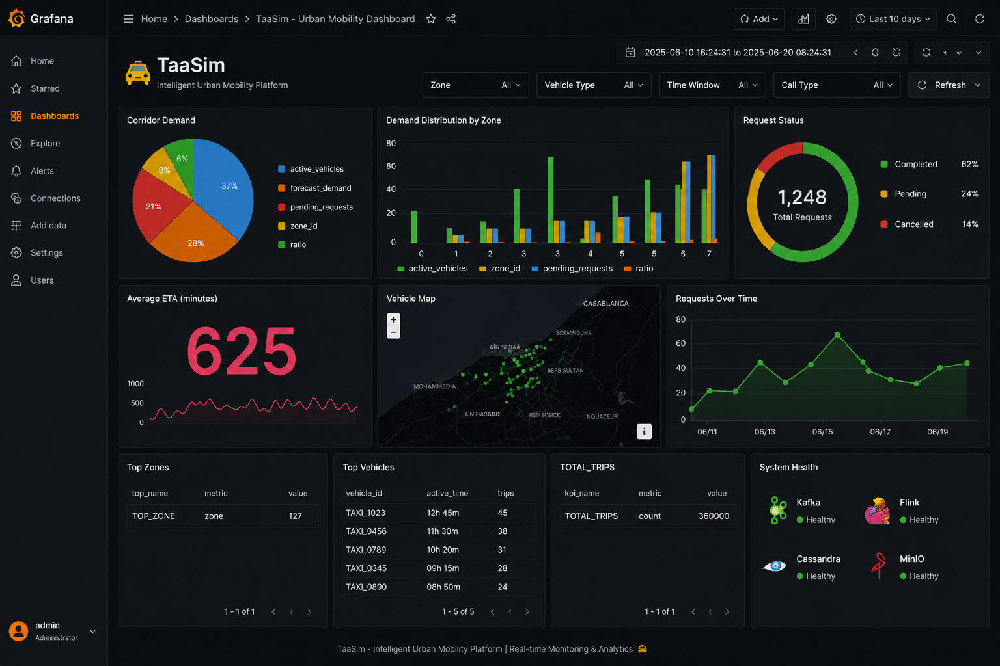

<div align="center">

# 🚖 TaaSim – Intelligent Urban Mobility Platform

### **Transport as a Service (TaaS) powered by Big Data and Machine Learning**

**Apache Kafka • Apache Flink • Apache Spark • Cassandra • MinIO • FastAPI • Grafana • Docker • Python**

A Big Data platform designed to optimize urban mobility in Casablanca through real-time stream processing, distributed analytics and Machine Learning-based demand forecasting.

---

**Developed by**

**IHRISSANE Oumayma • BEN.AAMMI Salma • LAAYOUNI Douae**

**ENSA Al Hoceima — Big Data Project (2025–2026)**

</div>

---

# 📑 Table of Contents

* 🎯 Overview
* ✨ Key Features
* 🏗️ System Architecture
* 🔄 Data Pipeline
* ⚙️ Technology Stack
* 📂 Project Structure
* 🤖 Machine Learning
* 🌐 REST APIs
* 📊 Grafana Dashboard
* 📁 Project Resources
* 👨‍💻 Authors

---

# 🎯 Overview

TaaSim (Transport as a Service) is an intelligent urban mobility platform designed to improve transportation services in Casablanca using Big Data technologies.

The platform continuously collects taxi GPS positions and trip requests, processes streaming data using Apache Flink, performs large-scale analytics with Apache Spark, stores operational data in Cassandra and MinIO, and predicts future mobility demand using Machine Learning.

---

# ✨ Key Features

✔ Real-time GPS stream processing

✔ Trip request simulation

✔ Automatic taxi-trip matching

✔ Real-time demand aggregation

✔ Batch ETL and analytics with Apache Spark

✔ Machine Learning demand forecasting

✔ REST APIs powered by FastAPI

✔ Interactive Grafana dashboards

✔ Docker-based deployment

---

# 🏗️ System Architecture

<p align="center">

</p>

The platform follows a three-layer architecture:

* **Data Layer** – Data ingestion, storage and processing.
* **Service Layer** – Business logic and REST APIs.
* **Application Layer** – Dashboards and user services.

---

# 🔄 Data Pipeline

<p align="center">

</p>

The complete processing pipeline is composed of:

**GPS & Trip Simulators**

⬇

**Apache Kafka**

⬇

**Apache Flink**

⬇

**Apache Cassandra**

⬇

**MinIO Data Lake**

⬇

**Apache Spark**

⬇

**Machine Learning**

⬇

**FastAPI**

⬇

**Grafana Dashboard & User Applications**

---

# ⚙️ Technology Stack

| Component    | Purpose                      |
| ------------ | ---------------------------- |
| Apache Kafka | Real-time data streaming     |
| Apache Flink | Stream processing            |
| Apache Spark | Batch processing & analytics |
| Cassandra    | Operational database         |
| MinIO        | Data Lake                    |
| FastAPI      | REST APIs                    |
| Grafana      | Data visualization           |
| Docker       | Containerization             |
| Python       | Development language         |

---

# 📂 Project Structure

```text
PROJET BIG DATA
│
├── README.md
├── Rapport_de_Projet.pdf
│
└── Code_Source
    ├── API
    ├── Configurations
    ├── DataLake_MinIO
    ├── Datasets_Remappes_Casablanca
    ├── Jobs_Flink
    ├── Machine_Learning
    ├── Notebooks
    ├── Simulateurs
    └── Spark_ETL
```

---

# 🤖 Machine Learning

The Machine Learning module is responsible for forecasting future mobility demand in Casablanca.

Main components:

* Feature Engineering
* Demand Forecasting Model
* Model Evaluation
* Demand Prediction API

---

# 🌐 REST APIs

## 🚖 Trip Reservation API

Allows users to create a new trip request that is automatically processed by the real-time matching pipeline.

---

## 📈 Demand Forecast API

Predicts future mobility demand for any Casablanca zone using the trained Machine Learning model.

---

# 📊 Grafana Dashboard

The dashboard provides real-time monitoring of the urban mobility platform.

Main indicators include:

* 📍 Live vehicle positions
* 🔥 Demand heatmap
* ⏱ Average ETA
* 📊 Spark KPIs
* 🤖 Demand forecasting

<p align="center">

</p>

---

# 📁 Project Resources

The complete project resources are available on Google Drive.

The shared folder contains:

* 📄 Technical report
* 💻 Complete source code
* 📂 Datasets
* 🤖 Machine Learning models
* 🐳 Docker configuration
* 📸 Screenshots
* 📑 Project documentation

### 🔗 Google Drive

**[(Insert your Google Drive link here)](https://drive.google.com/drive/folders/1LVK9xYmEamguhuKjnvxhZJBFUTKHxqy8)**

---

# 👨‍💻 Authors

* **IHRISSANE Oumayma**
* **BEN.AAMMI Salma**
* **LAAYOUNI Douae**

---

<div align="center">

### ⭐ If you find this project interesting, don't hesitate to leave a star!

</div>
